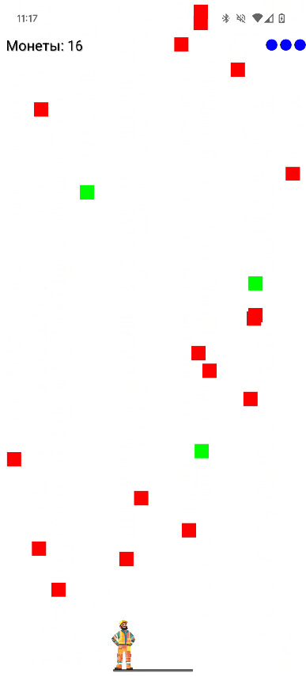

   

# Falling Objects Game 🎮

Falling Objects — это простая и увлекательная Android-игра, в которой игрок управляет персонажем, чтобы ловить падающие объекты. Управление осуществляется с помощью акселерометра.

## Особенности 🚀

 - Управление с помощью акселерометра
 - Система очков и увеличивающейся сложности
 - Замедление персонажа с маленькой вероятностью при сборе объекта
 - Система жизней

## Скриншоты 📱
 
  

